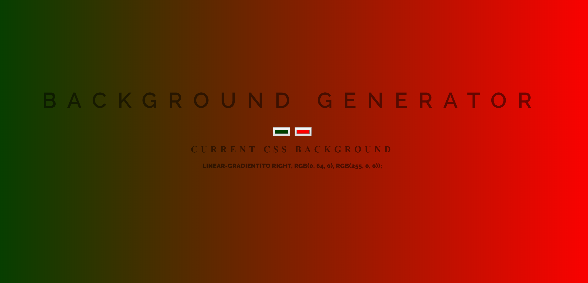

# Background Generator

This app was created using vanilla Javascript to produce a background generator with a gradient. The user can pick colors from two interactive color boxes, and the new background gradient will be applied with the current RGB values displayed.     

# Preview

# Author

Simon Maher